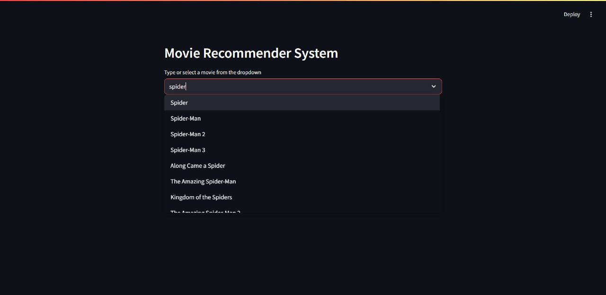
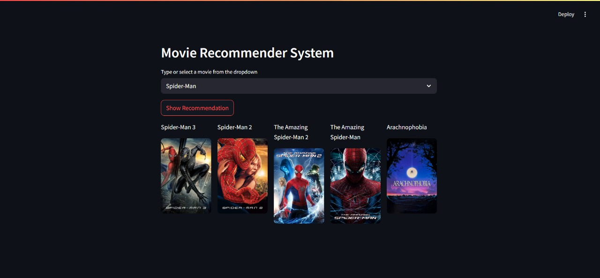

# 🎬 Movie Recommendation System

## 📖 About

This project is a **Content-Based Movie Recommendation System** built using **Natural Language Processing (NLP)** techniques like **Cosine Similarity**. It recommends movies based on a user's input by comparing the content features of films such as genres, cast, and storyline.

🔍 Just enter the name of a movie you like, and the system will recommend similar titles that match your preferences!


---

## 🚀 Live Preview

🌐 *You can try it out here* : https://whattowatchnext.streamlit.app

---

## ✨ Features

- 🎥 Get instant movie recommendations by typing a title.
- 🧠 Uses NLP and cosine similarity for content matching.
- ⚡ Built with **Streamlit** for fast, interactive, and responsive UI.
- 📊 Modular and clean codebase for easy enhancements.

---

## 🛠 Tech Stack

| Category       | Technologies Used                      |
|----------------|------------------------------------------|
| 🧠 NLP          | Scikit-learn, Cosine Similarity          |
| 💬 Language     | Python                                  |
| 🎛 Framework    | Streamlit                               |
| 📦 Data         | Pandas, NumPy, TMDB/IMDB Dataset         |
| 📁 ML Model     | Pickled content-similarity model         |

---

## 🖼 Sample Images

### 🔍 Search Interface:


### 🎥 Recommendations Output:


---

## 🗂 Project Structure

```

movie-recommender-system/
│
├── data/                         # Movie dataset(s)
│   └── movies.csv
│
├── images/                       # Images for README
│   ├── search_interface.jpg
│   └── recommendations_output.jpg
│
├── model/                        # Saved models
│   └── similarity.pkl
│   └── movie_list.pkl
│
├── app.py                        # Streamlit app entry point
├── Movie_Recommendation.ipynb    # Development and analysis notebook
├── requirements.txt              # Dependencies
└── README.md                     # Project readme

````

---

## ⚙️ Installation & Setup

### ✅ Prerequisites

- Python 3.7 or higher
- pip (Python package manager)

### 📥 Clone the Repo

```bash
git clone https://github.com/kaushik-kadari/movie-recommender-system.git
cd movie-recommender-system
````

### 📦 Install Dependencies

```bash
pip install -r requirements.txt
```

### 🏁 Run the Streamlit App

```bash
streamlit run app.py
```

Open the displayed local URL in your browser (usually `http://localhost:8501/`).

---

## 🔮 Future Enhancements

* 🤖 **LLM-Based Recommendations** using fine-tuned large language models.
* 🧠 Integration with **Vector Databases** like Pinecone/FAISS for real-time semantic search.
* 🌐 Deploy to **Streamlit Cloud**, **Render**, or **Hugging Face Spaces**.
* 🗣 Multilingual support and **voice-based search**.
* 🧩 Combine with **collaborative filtering** for hybrid recommendations.

---

## 🤝 Contributing

Contributions are welcome! 🙌

1. Fork the repository
2. Create your feature branch (`git checkout -b feature/your-feature`)
3. Commit your changes (`git commit -m 'Add new feature'`)
4. Push to the branch (`git push origin feature/your-feature`)
5. Open a Pull Request

---

## 🙏 Thank You

Thanks for checking out this project! Made with ❤️ by a movie and ML enthusiast.
If you liked it, please ⭐ the repo and share it with your friends!

---